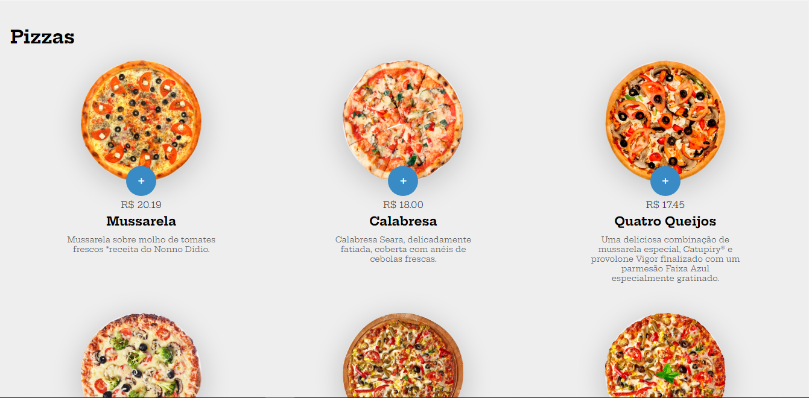
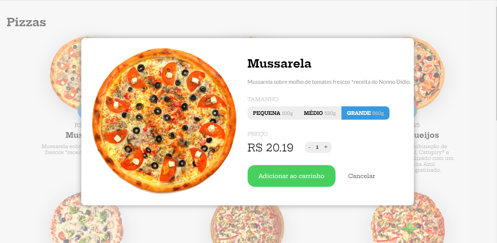
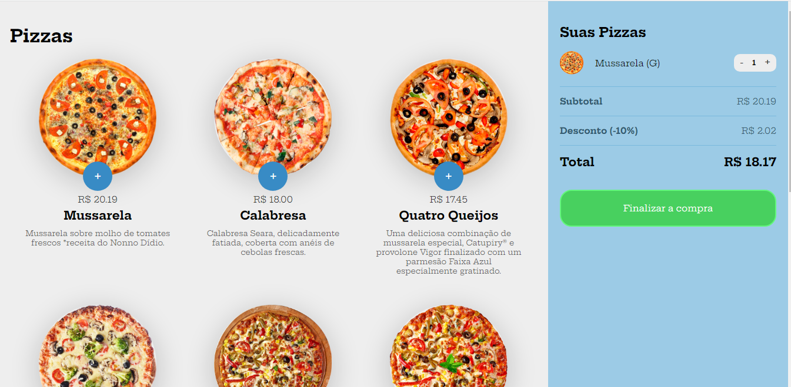

# 💻  Sobre o Projeto:
Este é meu primeiro projeto com o uso de Java script desenvolvido durante o módulo de Java script do curso oferecido pela B7web, com o objetivo de evoluir a construção individual do aluno. Foi desenvolvido um site para uma pizzaria e na página foram utilizadas apena as tecnologia HTML5,CSS3 e Java Script.
 
# 🛠 Tecnologias utilizadas:

    <ul>
        <li>HTML</li>
        <li>CSS</li>
        <li>JavaScript</li>
    </ul>

# ⚙️ Funcionalidades:
<li>Na primeira seção da página, os usuários serão apresentadas diversas pizzas podendo escolher qual sabor de pizza comprar</li>
<li>Após escolher o sabor e clicar na pizza, será apresentado um modal com diversas informações sendo elas, o tamanho da pizza, uma breve descrição dos ingredientes, o valor da pizza e a quantidade de pizzas que o usuário vai querer.</li>
<li>Em seguida, a pizza pode ser adicionada no carrinho com a apresentação de um subtotal e um desconto sobre o valor da pizza, logo após isso,e feito o valor final podendo finalizar a compra. </li>

# Visualização Online:

O resultado final do projeto está disponível para visualização online através da plataforma Vercel. Acesse o link abaixo para visualizar o website:
 
 https://projeto-pizzaria-bice.vercel.app/</li>
 

# 🎨 Pré-visualização :
## Apresentação das Pizzas

## Modal da pizza:

## Carrinho:

# 🦸 Autor:

 
<a href="https://www.linkedin.com/in/jo%C3%A3o-vitor-ribeiro-dias-339a56258/" target="_blank">João Vitor RIbeiro Dias</a>
